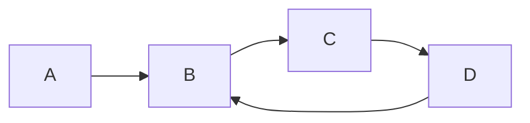

# Fake gren package

This is a fake package to test [the gren package site](https://packages.gren-lang.org/).

Here's a change to the README oh boy!

Here's some code:

```elm
one = "two"
two = "three"
```

and a chart:



Neat!
